<p align="center">
   <a href="https://github.com/Zoltw/curcumo">
     
   </a>
 </p>
<br/>
    <div align="center">
        <a>
            
            
            
            
            
        </a>
    </div>
<br/>

## 1. Setting up environment

### Requirements
- [Docker](https://docs.docker.com/get-docker/)

### Setup

1. Make sure that you have `Docker` installed and running.
2. Clone the repository
```bash
git clone https://github.com/Zoltw/curcumo.git
```
3. Create an .env file, which includes database connection details.
```bash
DB_NAME=''
DB_USER=''
DB_PASSWORD=''
```
4. Start docker containers in root directory
```bash
docker compose up
```
5. Open `http://localhost:8080` in your browser.

## 2. Some screenshots

<p float="center">
    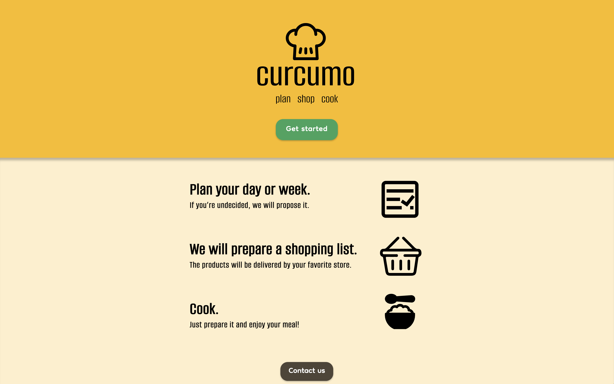
    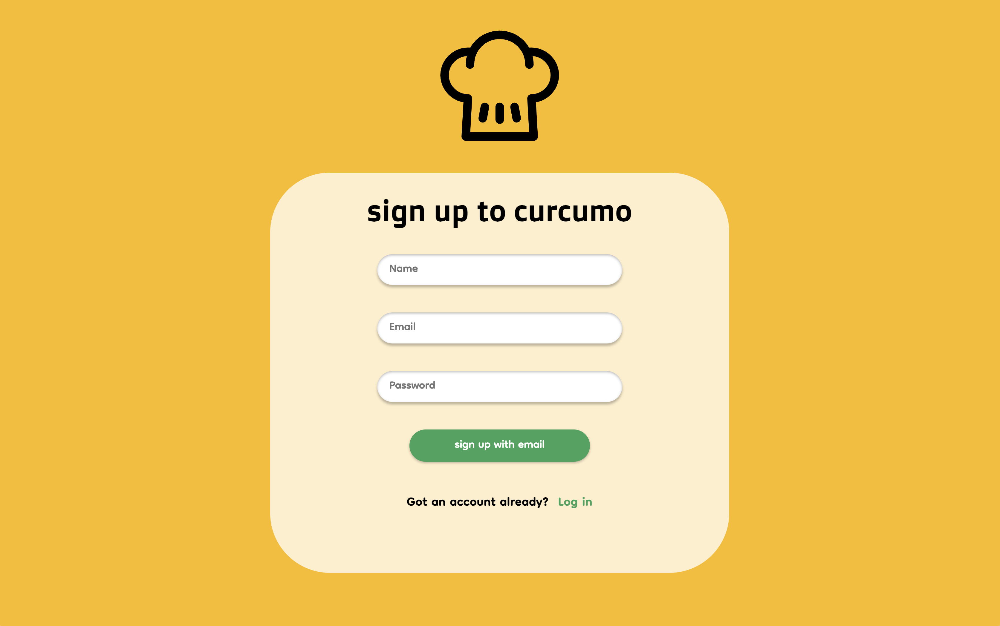
    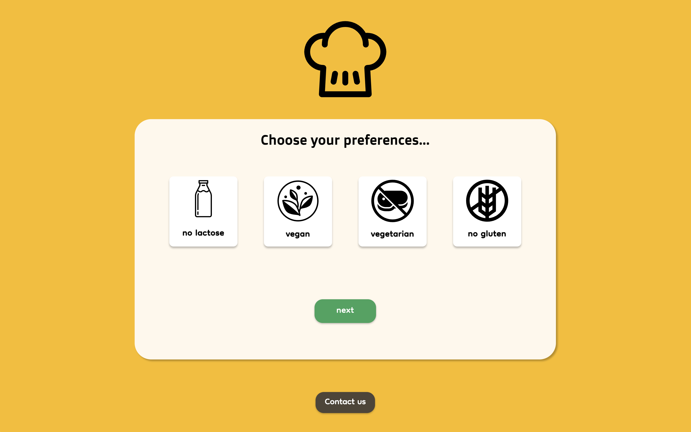
    
    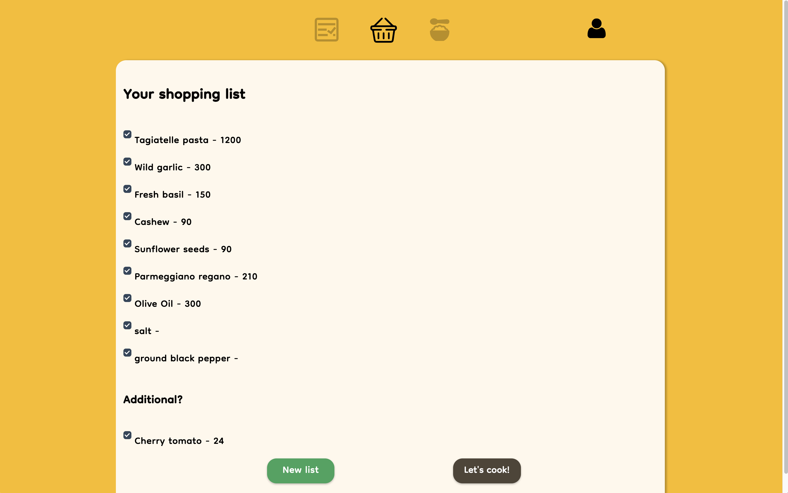
    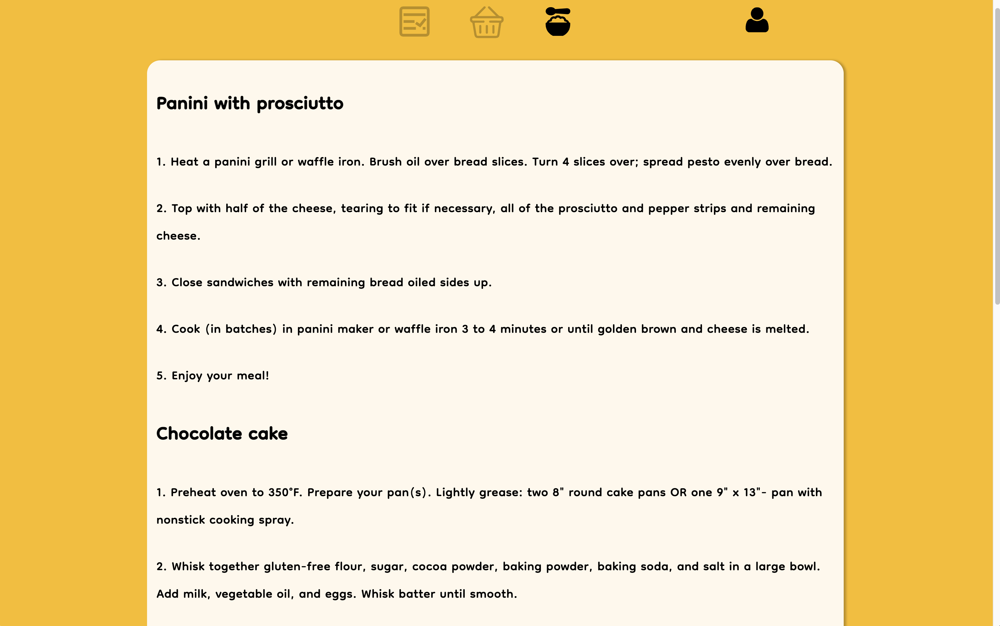
</p>
<p float="center">
    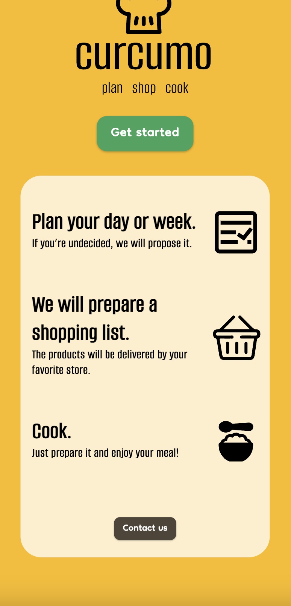
    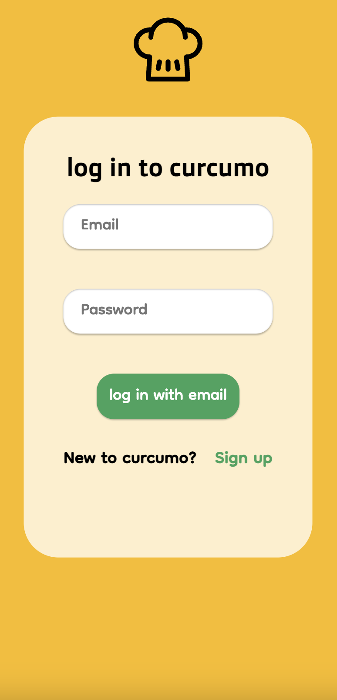
    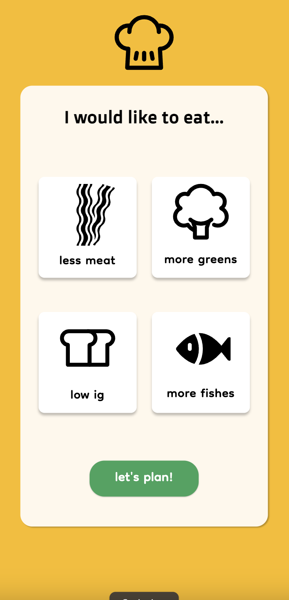
    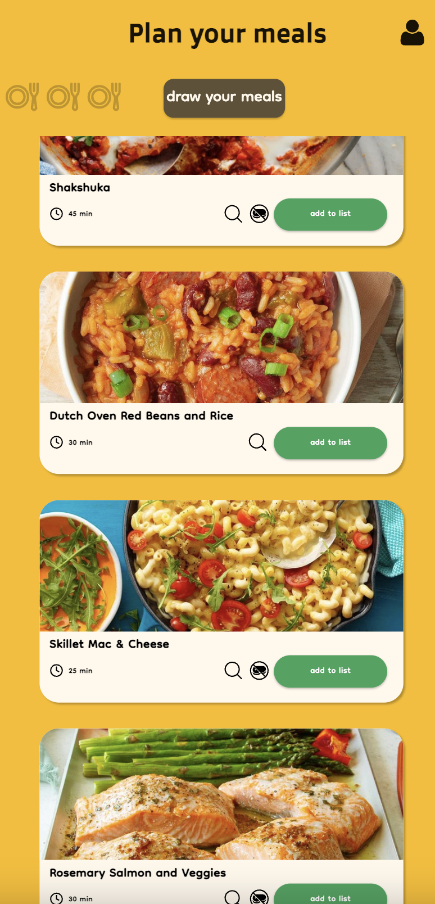
    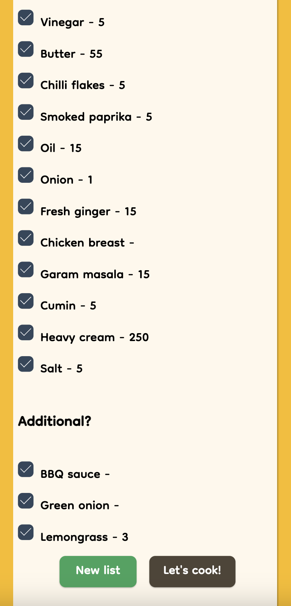
    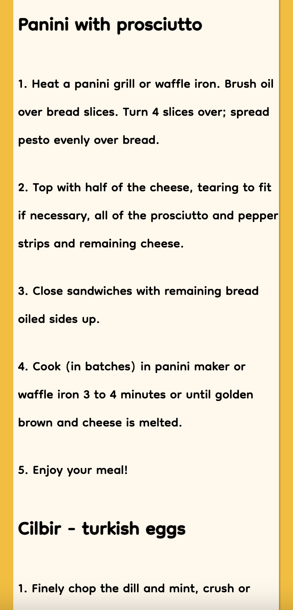
</p>

## 3. ERD Diagram

<p float="center">
    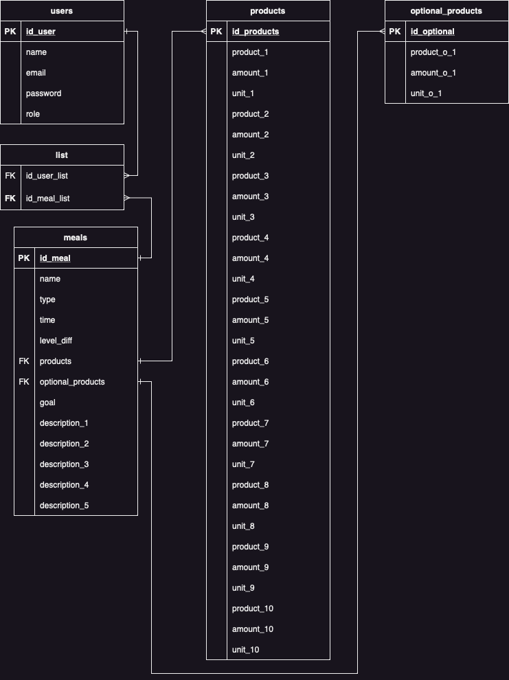
</p>